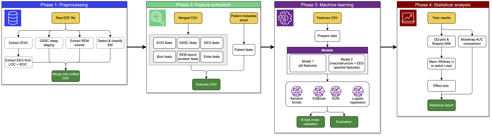

<div align="center">
    <h1>
        EOG_REM: <br> 
        EOG-Only Digital Biomarkers for REM Sleep Behavior Disorder and Parkinson’s Disease
    </h1>
</div> 

<div align="center">
    
    [](https://www.gnu.org/licenses/agpl-3.0)
</div>    

### Goal: <br>
Develop and validate EOG-only markers of abnormal REM physiology and build machine-learning models to detect RBD (REM Sleep Behavior Disorder) and PD (Parkinson's Disease) in a mixed clinical cohort.

## Table of Contents

- [Background](#background)
- [Install](#install)
- [Usage](#usage)
  - [Data setup](#data-setup)
  - [Phase 1 — Preprocessing](#phase-1--preprocessing-mainpy-process)
  - [Phase 2 — Feature extraction](#phase-2--feature-extraction-mainpy-extract)
  - [Full pipeline](#full-pipeline)
  - [Report & cleanup](#report--cleanup)
  - [WASO — Wake After Sleep Onset](#waso---wake-after-sleep-onset-add_wasopy)
  - [Machine learning](#machine-learning)
  - [Statistical analysis](#statistical-analysis)
- [Features](#features)
- [Notebooks](#notebooks)
- [Repository structure](#repository-structure)
- [Known Limitations](#known-limitations)
- [License](#license)
- [Credits / Acknowledgements](#credits--acknowledgements)

<br>
<h2 align="center"> 🔬 Background </h2>

REM Sleep Behavior Disorder (RBD) is a strong prodromal marker of Parkinson's disease (PD) and related synucleinopathies. The polysomnographic hallmark of RBD is REM Sleep Without Atonia (RSWA), typically quantified using chin/limb EMG. However, many emerging wearable sleep systems do not record high-quality EMG, motivating the need for biomarkers that rely on minimal channels.

Electrooculography (EOG) is present in essentially all PSGs and can capture both eye movements and peri-ocular/facial muscle contamination, potentially serving as an indirect proxy for RSWA. This project develops and validates EOG-only markers using polysomnography recordings from the Danish Center for Sleep Medicine (DCSM).

**Expected outcomes:**
- A reproducible EOG-only feature pipeline for REM phenotyping.
- Quantitative evidence for which EOG-derived markers best capture RBD/PD signatures.
- A validated ML screening model suitable for translation to minimal-sensor wearable paradigms.

<br>
<h2 align="center"> 🔧 Install </h2>


Clone the repository:
```bash
git clone https://github.com/EOG-Bachelor-project/EOG_REM.git
cd EOG_REM
```

### 1. Create conda environment

#### Windows
```powershell
conda env create -f environment-win.yml
conda activate BPML
```

#### macOS/Linux
```Terminal
conda env create -f environment-mac.yml
conda activate BPML
```

### 2. Install GSSC

> This step is required. GSSC must be installed separately from GitHub to avoid pip overriding the pinned numpy version required by numba.

#### Windows
```powershell
.\post_install.bat
```

#### macOS/Linux
```Terminal
pip install git+https://github.com/jshanna100/gssc.git --no-deps
pip install "numpy>=1.24,<2.0" --force-reinstall
```

#### Deactivate environment
```bash
conda deactivate
```

<br>
<h2 align="center">🚀 Usage</h2>


The pipeline is driven by `main.py` and runs in two phases: **preprocessing** and **feature extraction**. GSSC inference runs on CPU by default — if a CUDA-capable GPU is available, set `use_cuda=True` in `GSSC_to_csv.py` and `extract_rems_n.py` for faster staging.

### Data setup

> **Note:** This pipeline was developed using data from the Danish Center for Sleep Medicine (DCSM) and some parts are written with their data format in mind. If you are using a different dataset, some parts of the code may need to be adapted.
```bash
/data/raw/
├── PatientMetadata.xlsx      # metadata and diagnostic labels (see format below)
│
├── PATIENT_1/
│   ├── recording.edf
│   └── lights.txt
│
├── PATIENT_2/
│   ├── recording.edf
│   └── lights.txt
│
└── ...
```
The `lights.txt` files must contain the lights-off and lights-on timestamps used to trim each recording to the intended sleep period. The Excel file must contain at minimum a session ID column and a diagnostic group column matching the expected labels: `Control`, `iRBD`, `PD(+RBD)`, `PD(-RBD)`, `PLM`.

### Pipeline overview



### Phase 1 — Preprocessing (`main.py process`)

Processes raw EDF recordings through 7 stages per patient:

1. Index sessions from raw EDF directory
2. Extract EOG signals (LOC, ROC) from EDF —> `eog_csv/`
3. Run GSSC automated sleep staging —> `gssc_csv/`
4. Extract REM eye movement events —> `extracted_rems/`
5. Detect & classify eye movements (phasic/tonic) —> `detected_ems/`
6. Extract EEG proxy signals via DTCWT —> `eeg_csv/`
7. Merge all outputs into a unified CSV —> `merged_csv_eog/`

The pipeline skips any stage whose output already exists. To reprocess from scratch:

```powershell
rm -rf eog_csv/ gssc_csv/ extracted_rems/ detected_ems/ eeg_csv/ merged_csv_eog/
python main.py process /data/raw --batch-size 9999
```

Otherwise:

```powershell
python main.py process /data/raw                   # process up to 10 patients
python main.py process /data/raw --batch-size 50   # process 50
```

### Phase 2 — Feature extraction (`main.py extract`)

Extracts features per subject across five modules (`eog`, `gssc`, `eeg`, `bout`, `patient`) and merges them into `features_csv/features.csv`.

```powershell
python main.py extract GlostrupRBDData.xlsx                     # all modules
python main.py extract GlostrupRBDData.xlsx --modules bout eog  # specific modules
python main.py extract GlostrupRBDData.xlsx --force             # re-extract from scratch
```

### WASO - Wake After Sleep Onset (`add_waso.py`)
This is a separate step because it was added later in the project and relies on the merged CSVs from Phase 1, since redoing phase 1 is time-consuming. It extracts features related to wakefulness during the sleep period, which may be relevant for RBD/PD phenotyping.
```powershell
# Compute WASO and append it to an existing features.csv (no reprocessing needed)
python add_waso.py --merged-dir merged_csv_eog/ --features-csv features_csv/features.csv --pattern "*_merged.csv.gz"
```


### Full pipeline

```powershell
python main.py all /data/raw GlostrupRBDData.xlsx          # process + extract + report
python main.py all /data/raw GlostrupRBDData.xlsx --force  # full pipeline, re-extract features
```

### Report & cleanup

```powershell
python main.py report               # generate HTML report from features.csv
python main.py cleanup              # compress intermediate CSVs to free disk space
python main.py cleanup --dry-run    # preview without compressing
```

### Machine learning (`ml.train`)

```powershell
python -m ml.train features_csv/features.csv --mode binary multiclass --binary-mode control_vs_all control_vs_irbd control_vs_pd
```

**Modes:**
- `binary`: pairwise — `control_vs_irbd`, `control_vs_pd`, `control_vs_all` 
- `multiclass`: four-class — Control, iRBD, PD(+RBD), PD(−RBD)
> Note: 
`control_vs_pd` is only PD(+RBD)
`control_vs_all` is iRBD + PD(+RBD)

Results and figures are saved to `reports/evaluation/`.

### Statistical analysis
To find out if our RBD-specific EOG feature extraction add value beyond what standard sleep metrics already tell you. We create a second model with only macrostructure sleep features (e.g. WASO) and EEG spectral features. We then compare the performance with bootstap AUC:
```powershell
python statistical_analysis\compare_models features_csv/features.csv --mode binary -binary-mode control_vs_all --evaluate

python statistical_analysis\compare_models features_csv/features.csv --mode binary -binary-mode control_vs_pd --evaluate

python statistical_analysis\compare_models features_csv/features.csv --mode binary -binary-mode control_vs_irbd --evaluate
```

>#### Group columns (`add_group_col.py`)
>To run some of the statistical analysis, we first need to add group labels to the features CSV. This script has the path hardcoded so to run it, make sure the path to the features CSV is correct.
>```powershell
>python add_group_col.py
>```

```powershell
# 1. QQ-plots for feature distributions and normality assessment
python statistical_analysis\qq-plot.py --csv features_csv/features_with_groups.csv --label-col group --positive-class "PD(+RBD)" --negative-class Control --out-dir reports\qq\pd_w_rbd_vs_control

python statistical_analysis\qq-plot.py --csv features_csv/features_with_groups.csv --label-col group --positive-class "PD(-RBD)" --negative-class Control --out-dir reports\qq\pd_wo_rbd_vs_control

python statistical_analysis\qq-plot.py --csv features_csv/features_with_groups.csv --label-col group --positive-class "iRBD" --negative-class Control --out-dir reports\qq\irbd_vs_control
```


```powershell
# 2. Univariate group tests (Welch's t-test or Mann-Whitney U based on normality)
python statistical_analysis\univariate_stats.py --csv features_csv/features_with_groups.csv --label-col group --positive-class "PD(+RBD)" --negative-class Control --test auto --out-dir reports\stats\control_vs_pd_w_rbd

python statistical_analysis\univariate_stats.py --csv features_csv/features_with_groups.csv --label-col group --positive-class "PD(-RBD)" --negative-class Control --test auto --out-dir reports\stats\control_vs_pd_wo_rbd

python statistical_analysis\univariate_stats.py --csv features_csv/features_with_groups.csv --label-col group --positive-class "iRBD" --negative-class Control --test auto --out-dir reports\stats\control_vs_irbd
```

```powershell
# 3. Compare effect sizes across comparisons for the top features identified in the univariate step (e.g. by absolute Cliff's delta)
python statistical_analysis\compare_effect_sizes.py --csvs "stats\control_vs_irbd\univariate_stats.csv" "stats\control_vs_pd\univariate_stats.csv" --labels "iRBD vs HC" "PD(+RBD) vs HC" --metric abs_cliffs_delta --out-dir reports\stats\comparisons
```
>Note: We are only interested in iRBD and PD(+RBD) since we are looking for markers of RBD pathology. PD(−RBD) is included as a negative control group to help identify features that are specific to RBD rather than general PD pathology. Statistical comparisons between PD(−RBD) and controls can be run as well, but they are not the main focus of the analysis.

<br>
<h2 align="center">📊 Features</h2>

145 features are extracted per subject across five modules, saved to `features_csv/features.csv`.

| Module | Features | Description |
|--------|----------|-------------|
| `eog` | 51 | EOG signal properties and eye movement characteristics during REM |
| `gssc` | 12 | Sleep staging probabilities and REM stability from the GSSC model |
| `eeg` | 31 | EEG proxy band power (delta, theta, alpha, beta) per sleep stage |
| `bout` | 17 | Phasic/tonic bout structure during REM |
| `extra` | 30 | Spectral band power per REM context (phasic/tonic), extended phasic/tonic bout structure, EM morphology, and sleep architecture |
| `patient` | 4 | Demographics and clinical metadata from patient records |

### Feature groups

**Sleep structure (17)** — recording and REM duration, stage fractions, REM episode count and duration statistics.

**EOG amplitude (6)** — mean, std, and 95th percentile of LOC/ROC amplitude during REM.

**REM events (8)** — count, rate, duration, amplitude, and rise slope of detected REM eye movement events.

**EM classification (10)** — slow (SEM) vs. rapid eye movement counts, rates, fractions, durations, and amplitudes during REM.

**EM stage counts (5)** — total eye movement counts per sleep stage (W, N1, N2, N3, REM).

**Phasic / Tonic (4)** — sub-epoch counts and fractions; `phasic_fraction` is a key RBD biomarker.

**Phasic / Tonic bouts (17)** — bout count, duration statistics, and rate for phasic and tonic REM sub-epochs; phasic↔tonic transition count.

**GSSC probabilities (8)** — mean stage probabilities during REM; `rem_certainty` replicates the Cesari et al. micro-sleep structure feature.

**REM stability (4)** — staging stability index, fragmentation index, wake-transition fraction, and overall REM amount.

**EEG band power (31)** — delta, theta, alpha, beta, total power, and theta ratio per stage (REM, N1, N2, N3, W); overall theta/beta ratio.

**Spectral band power by REM context (12)** — delta, theta, and gamma power during overall REM, phasic REM, and tonic REM; theta/delta ratio per context.

**Extended phasic/tonic structure (12)** — bout duration percentiles (p25, p75, p90), longest bout, long bout fraction, and phasic/tonic transition rate; latency to first phasic bout from REM onset.

**EM morphology (4)** — mean rise and fall slopes averaged across LOC and ROC channels, amplitude variance, and SEM fraction across all EM events.

**Sleep architecture (2)** — REM latency from sleep onset and number of distinct REM cycles.

> A full feature cheat-sheet with descriptions and distribution plots is available in the HTML report generated by `python main.py report`.

<br>
<h2 align="center">📓 Notebooks</h2>

Three notebooks are provided for post-extraction inspection, quality control, and results analysis.

### `feat_dashboard.ipynb`
Feature extraction dashboard and data quality checks.
- Run extraction and append new patients to an existing `features.csv`
- NaN counts per feature and per subject, with detailed per-patient missing feature reports
- Group label completeness check (Control, iRBD, PD(-RBD), PD(+RBD), PLM)
- Compress merged CSVs to free disk space
- Clean up duplicate ID/label columns after merging

### `feat_inspect.ipynb`
Cohort overview and per-patient inspector.
- Summary table: subject count, feature count, NaN distribution across the cohort
- Group breakdown bar chart and feature category completeness (colour-coded by completeness %)
- NaN audit: features ranked by missing rate
- Feature distributions overlaid by diagnostic group
- Per-patient inspector: set a `PATIENT_ID` to see all feature values, NaN flags, and a z-score comparison against the patient's group mean

<br>
<h2 align="center">Repository structure</h2>

```
.
├── LICENSE
├── README.md
├── SECURITY.md
├── Tests
│   ├── REM_classification_test.py
│   ├── __init__.py
│   ├── check_edf_units.py
│   ├── test_eeg_signals_from_eog.py
│   ├── test_em_in_stages.py
│   ├── test_eog_features.py
│   ├── test_gssc_features.py
│   ├── test_merge.py
│   ├── test_percentage_of_phasic&tonic.py
│   └── test_saving_files.py
├── __init__.py
├── add_group_col.py
├── add_waso.py
├── analysis
│   ├── detect_em.py
│   ├── feat_report.py
│   └── plot.py
├── conda
├── environment-mac.yml
├── environment-win.yml
├── extract_rems.py
├── features
│   ├── bout_feats.py
│   ├── eeg_feats.py
│   ├── eog_feats.py
│   ├── extra_feats.py
│   ├── gssc_feats.py
│   ├── patient_feats.py
│   └── rem_epoch_duration_feats.py
├── images
│   └── Flowchart_1.jpg
│   
├── main.py
├── ml
│   ├── evaluate.py
│   ├── model2.py
│   ├── prepare_data.py
│   └── train.py
├── notebooks
│   ├── feat_dashboard.ipynb
│   └── feat_inspect.ipynb
├── post_install.bat
├── preprocessing
│   ├── GSSC_to_csv.py
│   ├── __init__.py
│   ├── channel_standardization.py
│   ├── edf_to_csv.py
│   ├── eeg_to_csv.py
│   ├── em_to_csv.py
│   ├── extract_rems_n.py
│   ├── index_file.py
│   ├── inspect_channel.py
│   ├── merge.py
│   ├── merge_patient_info.py
│   ├── remove_artefacts.py
│   └── upsample.py
├── remerge.py
└── statistical_analysis
    ├── aggregate_importance.py
    ├── compare_effect_sizes.py
    ├── compare_models.py
    ├── delong_test.py
    ├── qq-plot.py
    └── univariate_stats.py

9 directories, 63 files
```

<br>
<h2 align="center">⚠️ Known Limitations</h2>

- **DCSM-specific format**: the pipeline was developed using data from the Danish Center for Sleep Medicine. Folder structure, channel naming, and metadata conventions may need to be adapted for other datasets. See inline comments in: 
    * `preprocessing/index_file.py`
    * `preprocessing/channel_standardization.py`
    * `preprocessing/merge.py`
    * `preprocessing/extract_rems_n.py`
    * `preprocessing/edf_to_csv.py`
    * `preprocessing/GSSC_to_csv.py`
    * `preprocessing/em_to_csv.py`
    * `analysis/feat_report.py`
(Some files may be missing in this list)
- **Memory usage**: very long recordings (>8 hours) may cause out-of-memory errors during feature extraction. If this occurs, process affected recordings individually with a batch size of 1 (`python main.py extract --batch-size 1`).
- **GSSC dependency**: GSSC must be installed manually after the conda environment is created. Skipping `post_install.bat` / the post-install step will cause silent failures during sleep staging.
- **Intermediate files**: the pipeline skips stages whose output already exists. If a stage fails mid-run it may leave an empty CSV that is mistaken for valid output. Run `python main.py cleanup --dry-run` to inspect, or manually delete suspect files before rerunning.
- **EOG-only setup**: the absence of EEG and EMG channels limits classification performance relative to full PSG-based systems. This is an inherent constraint of the research question, not a pipeline bug.

### Expected runtime and disk space

Approximate figures based on the DCSM dataset (recordings of 7–9 hours at 250 Hz):

| Stage | Time per patient | Disk space per patient |
|-------|-----------------|----------------------|
| Phase 1 — Preprocessing (CPU) | 20–50 min | ~1 GB (compressed to ~200 MB after cleanup) |
| Phase 2 — Feature extraction | 1–3 min | <1 MB |


> GSSC staging is the bottleneck in Phase 1. Run `python main.py cleanup` after preprocessing to recover disk space.

<br>
<h2 align="center">📜 License</h2>

[](https://www.gnu.org/licenses/agpl-3.0)
This project is licensed under the [GNU Affero General Public License v3.0 (AGPL-3.0)](https://www.gnu.org/licenses/agpl-3.0.html).


<br>
<h2 align="center">Credits / Acknowledgements</h2>

- Thanks to our supervisor and co-supervisor for their guidance and support:
    - A. Brink-Kjaer
    - P. Jenum
    - U. Hanif
- The Danish Center for Sleep Medicine for providing the dataset and domain expertise.
- Sleep staging powered by [GSSC](https://github.com/bdsp-core/GSSC).
- REM event detection based on the `detect_rem_jaec` algorithm.